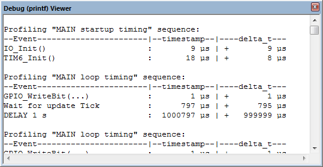

Code profiling for STM32
===

Features
---
Simple and fast code profiler for STM32 ARM Cortex-M CPU family.   
Allow measuring time intervals and printing it in table view to SWO debug port.
>*Example data print*   
```
Profiling "Start" sequence:                                
--Event-----------------------|--timestamp--|---delta_t----
GLCD_Init                     :       41 us | +       41 us
OLED_Init                     :     5288 us | +     5247 us
u8g_SetFont                   :     5292 us | +        4 us
HAL_Delay(10)                 : 10004967 us | +  9999675 us
```
Minimum measure time = 0 µs   
Maximum measure time = 4294967 s (49,7 days)   
Time accuracy ±1 µs.

Easy to use, easy to port to another CPU and programming language.

*Technical background:   
SWO is a dedicated pin of ARM's Cortex-M debug interface. While it can be used to output various information
in real time by the CPU, it's main usage is terminal I/O in real time with very low intrusion. Most programs can
perform debug outputs without losing their real time behavior.*

How to use
---
start profiling session   
**`PROFILING_START("*session name*");`**

Insert timestamp command as many times as necessary.[<sup>[1]</sup>](#notes)   
**`PROFILING_EVENT("*event name*");`**

close profiling session and read it times on Serial wire viewer (SWV)   
**`PROFILING_STOP();`**   
      
       
       
> *Example code*   
```c
int main(void)
{
  SysTick_Config(SystemCoreClock / 1000);
  
  PROFILING_START("MAIN startup timing");

  Init_IO();
  PROFILING_EVENT("IO_Init()");

  Init_TIM6();
  PROFILING_EVENT("TIM6_Init()");

  PROFILING_STOP();

  while (1)
  {
    PROFILING_START("MAIN loop timing");

    GPIO_WriteBit(GPIOE, GPIO_Pin_9, (((Tick % 1000) > 500) ? Bit_SET : Bit_RESET));
    PROFILING_EVENT("GPIO_WriteBit(...)");

    // Wait for update Tick
    delay_tick = Tick;
    while (delay_tick == Tick);
    PROFILING_EVENT("Wait for update Tick");

    // Delay 1000 ms
    delay_tick = Tick + 1000;
    while (delay_tick > Tick);
    PROFILING_EVENT("DELAY 1 s");

    // Stop profiling and print
    PROFILING_STOP();
  }
}
```


> *Debug (printf) Viewer example*   
```
Profiling "MAIN startup timing" sequence: 
--Event-----------------------|--timestamp--|----delta_t---
IO_Init()                     :        9 µs | +        9 µs
TIM6_Init()                   :       18 µs | +        8 µs

Profiling "MAIN loop timing" sequence: 
--Event-----------------------|--timestamp--|----delta_t---
GPIO_WriteBit(...)            :        1 µs | +        1 µs
Wait for update Tick          :      797 µs | +      795 µs
DELAY 1 s                     :  1000797 µs | +   999999 µs

```

-------------   
For more information, how to use the Keil µVision Debug (printf) Viewer see  http://www.keil.com/support/man/docs/ulink2/ulink2_trace_itm_viewer.htm   
You can also use ST-LINK - Printf via SWO viewer feature or other debugging software with SWO Viewer support.

-------------   
<a name="notes"></a>`note 1` The maximum number of events is defined in MAX_PROFILING_EVENT_COUNT (profiling.h)
